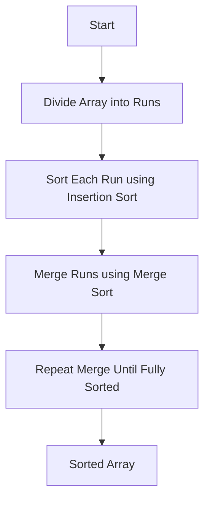

# 🔢 Tim Sort Algorithm

A C implementation of the **Tim Sort Algorithm**, a hybrid sorting technique derived from **Merge Sort and Insertion Sort**. Tim Sort is designed to perform efficiently on real-world data, especially datasets that already contain partially sorted sequences.

Originally developed by **Tim Peters (2002)** for Python, it is now used in major programming languages like **Python (`list.sort()`) and Java (`Arrays.sort()`)**.

---

# 📌 Overview

Tim Sort works by:

1. Dividing the array into small segments called **runs**
2. Sorting each run using **Insertion Sort**
3. Merging the runs using a **Merge Sort strategy**

Because it detects existing ordered sequences, it performs fewer comparisons and operations on partially sorted datasets.

---

# ⚙️ Algorithm Workflow



---

# 📊 Time Complexity

| Case         | Complexity |
| ------------ | ---------- |
| Best Case    | O(n)       |
| Average Case | O(n log n) |
| Worst Case   | O(n log n) |

---

# 💾 Space Complexity

**O(n)** auxiliary space is required during the merge phase.

---

# ✨ Key Features

* Hybrid algorithm (Merge Sort + Insertion Sort)
* Stable sorting algorithm
* Adaptive to partially sorted datasets
* Efficient for real-world applications
* Used in Python and Java standard libraries

---

# 🧠 How Tim Sort Works

## Step 1 — Identify Runs

The algorithm scans the array to find naturally sorted subsequences (runs).

Example:

```
Input:
[5, 7, 9, 2, 4, 6, 1]

Runs Detected:
[5,7,9]   [2,4,6]   [1]
```

---

## Step 2 — Sort Runs

Each run is sorted using **Insertion Sort**.

```
Run Size ≤ Threshold → Use Insertion Sort
```

---

## Step 3 — Merge Runs

Runs are merged similar to **Merge Sort**.

```
[5,7,9]   [2,4,6]

↓ Merge

[2,4,5,6,7,9]
```

---

# 🖥 Example

### Input

```
Array: 9 3 1 5 13 12
```

### Output

```
Sorted Array: 1 3 5 9 12 13
```

---

# 📂 Project Structure

```
TimSort/
│
├── timsort.c
├── timsort.h
├── main.c
└── README.md
```

---

# 🚀 How to Run

### Compile

```bash
gcc timsort.c main.c -o timsort
```

### Execute

```bash
./timsort
```

---

# 📈 Performance Advantage

Tim Sort performs better than traditional sorting algorithms when:

* Data is partially sorted
* Dataset contains natural runs
* Large datasets need stable sorting

| Algorithm      | Best       | Average        | Worst          |
| -------------- | ---------- | -------------- | -------------- |
| Insertion Sort | O(n)       | O(n²)          | O(n²)          |
| Merge Sort     | O(n log n) | O(n log n)     | O(n log n)     |
| **Tim Sort**   | **O(n)**   | **O(n log n)** | **O(n log n)** |

---

# 📚 Applications

* Python's built-in sorting
* Java standard library sorting
* Database systems
* Real-world datasets with partial ordering
* Large-scale data processing

---

# 👨‍💻 Author

**Ashutosh Chauhan**
SRM Institute of Science and Technology
Department of Networking and Communications

---

⭐ If you like this project, consider **starring the repository**.
